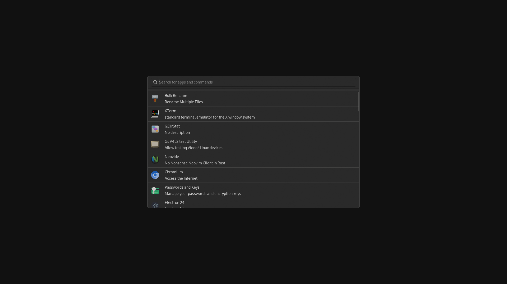

# Ruvoke

An app launcher made in Rust using [gtk-rs](https://gtk-rs.org/) bindings.



## Installation

With cargo

```bash
cargo install ruvoke
```

## On Hyprland

```conf
windowrulev2 = float,class:(eu.tortitas.runst)
```
